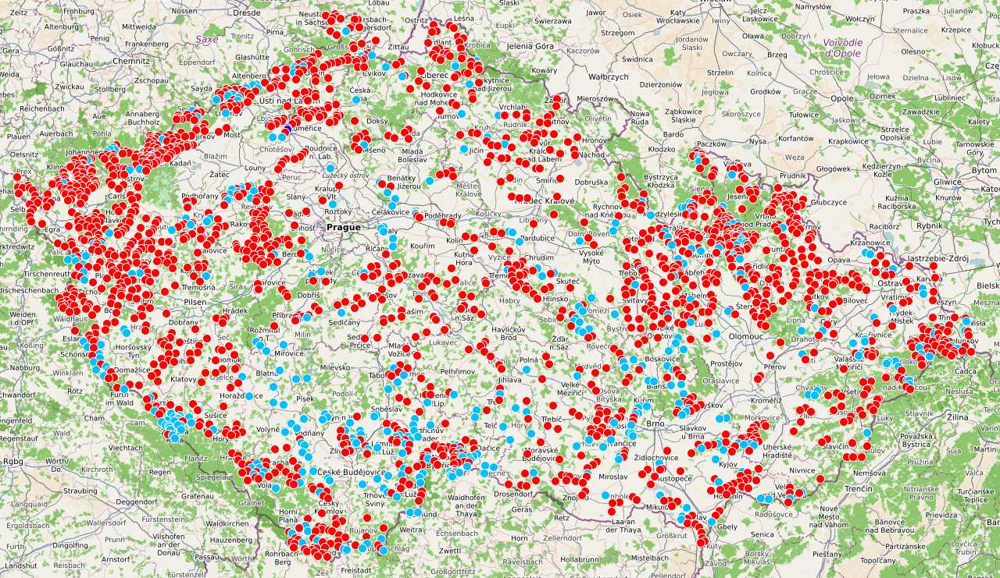
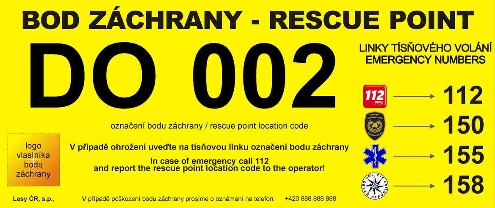

# Body záchrany v OSM
**Úvod**

Tento [projekt](https://github.com/RichMar/BZ) jsem vytvořil jako pomůcku při zadávání bodů záchrany (BZ) na území ČR do [Openstreetmap](https://www.openstreetmap.org/#map=8/49.368/15.087) (OSM).
Před lety jsem původně od Lesů ČR (jako zřizovatele bodů, v dnešní době spravuje body záchrany [HZS ČR](https://www.hzscr.cz/clanek/body-zachrany-na-uzemi-cr.aspx)) obdržel kompletní seznam bodů záchrany po celé ČR.
Jelikož licence, kterou mi k tomu poskytli, nesplňuje požadavky pro přímé zadání do OSM, rozhodl jsem se, že na to půjdu od lesa.

  

**Vizualizace**

Pro názornost jsou body, které chybí v OSM, zobrazeny pomocí služby **[uMAP](https://umap.openstreetmap.fr/cs-cz/map/body-zachrany_554926#8/49.434/14.746)**  červenou barvou. Body, které již v OSM existují, jsou vykresleny světle modrou. Problémové body jsou zobrazeny tmavě modrou barvou.

**Popis funkce**

V seznamu LČR je obsaženo 2171 bodů záchrany ve formátu csv (stav je z roku 2020). Skript po načtení seznamu začne generovat dotazy, které odesílá na službu [Overpass turbo](https://overpass-turbo.eu). V OSM existují dva způsoby značení bodů záchrany, a to:
- [highway=emergency_access_point](https://wiki.openstreetmap.org/wiki/Cs:Tag:highway%3Demergency_access_point)
- [emergency=access_point](https://wiki.openstreetmap.org/wiki/Cs:Tag:emergency%3Daccess_point)
 
Pro jeden bod se tedy odesílají dva dotazy. Jelikož délka jednoho dotazu je omezená, proto jeden dotaz obsahuje maximálně 20 bodů. Dotaz je proveden tak, že server vrátí všechny body záchrany v okruhu 100 m od zadané souřadnice. Seznam odeslaných dotazů se ukládá do souboru [comm_wr.txt](comm_wr.txt).
- Všechny nalezené body se ukládají do souboru [OSMBZ.csv](OSMBZ.csv).
- Nalezené body, které mají problém s hodnotou *REF* (např. hodnota chybí nebo neodpovídá seznamu LČR), jsou uloženy do souboru [OSMbodychybejiciref.csv](OSMbodychybejiciref.csv). Co jsem zatím zjistil, tak většina chbějících *REF* se nachází pod hodnotou *NAME*, takže to se dá opravit od stolu. Dále jsou zde body se vzdáleností větší než 100 m od souřadnice převzaté od LČR. Pro zajímavost je vypočtená vzdálenost těchto bodů uložena na konci souboru [comm_wr.txt](comm_wr.txt) (uvedené vzdálenosti jsou v metrech).
- Body, které je potřeba do OSM doplnit, se ukládají primárně do [OSMbodybezref.csv](OSMbodybezref.csv) bez hodnoty *REF*. Následně jsou pro lepší přenositelnost převedeny do formátu **[gpx](OSMbodybezref.gpx)** ***([stáhnout gpx](https://git-link.vercel.app/api/download?url=https%3A%2F%2Fgithub.com%2FRichMar%2FBZ%2Fblob%2F0368fa9a0a769373ffd126d98a59e0269fdc14f1%2FOSMbodybezref.gpx))*** a [geojson ](OSMbodybezref.geojson).
Script se spouští každých 24 hodin.

**Zdávání bodů záchrany**

Pro práci offline lze [stáhnout gpx soubor](https://git-link.vercel.app/api/download?url=https%3A%2F%2Fgithub.com%2FRichMar%2FBZ%2Fblob%2F0368fa9a0a769373ffd126d98a59e0269fdc14f1%2FOSMbodybezref.gpx) s body, které je třeba do OSM doplnit. V OSM existují dva způsoby zadávání bodů záchrany viz výše. V obou případech je potřeba vyplnit hodnotu *REF* viz příklad [zde](https://wiki.openstreetmap.org/wiki/Cs:Tag:highway%3Demergency_access_point). Hodnota *REF* by se měla vyplňovat bez mezer a prázdných znaků. Naopak nuly je třeba zapsat všechny.
Pozor je třeba dávat u zadávání bodů v [Osmandu](https://osmand.cz), kde při zadávání *highway=emergency_access_point* je přednastavena pouze hodnota *NAME*.

V ideálním případě by bylo vhodné pořídit fotografii bodu a nahrát ji do **[Fody](https://openstreetmap.cz/fody)**, protože LČR nemá v těch bodech úplný pořádek, takže by se mohlo stát, že číslo bodu v reálu bude jiné než to na seznamu. Ale uvidíme, třeba jsem zbytečně paranoidní.

V případě, že v se reálu na zadané souřadnici bod záchrany nenachází, pošlete jeho souřadnice [mě](https://www.openstreetmap.org/user/Spratek). Předpokládám, že by takových bodů nemělo být moc.

    <em>Značení bodú záchrany v terénu</em>

Na sereveru openstreetmap.org se standartně body záchrany nevykreslují - [ukázka](https://www.openstreetmap.org/node/10741601102).

Server openstreetmap.cz bod záchrany vekresluje v případě, že je nahraná jeho fotografie ve Fody - [ukázka](https://openstreetmap.cz/#map=19/49.70533/16.58033&layers=dG).

**Statistika**

Skript vytváří soubor statistika.csv, kam se ukládají tyto hodnoty: datum, celkový počet bodů v OSM a přírůstek. Do tohoto souboru je hodnota zapsána jen pokud se počet bodů v OSM zvýšil.  Tyto hodnoty jsou také zpracovány pomocí [koláčového diagramu](https://github.com/RichMar/BZ/wiki), kde je stav BZ znázorněn v procentech a ve [sloupcovém grafu](https://github.com/RichMar/BZ/wiki/Prirustky-bodu-zachrany-do-OSM) kde jsou znázorněny přírůstky v jednotlivých dnech.

**Poděkování**

Rád bych poděkoval uživateli [mahdi1234](https://www.openstreetmap.org/user/mahdi1234) za inspiraci jeho projektem na [tříděný odpad](https://umap.openstreetmap.fr/en/map/odpad_bez_urceni_cr_553696#8/49.398/15.955) a za jeho cenné rady.
